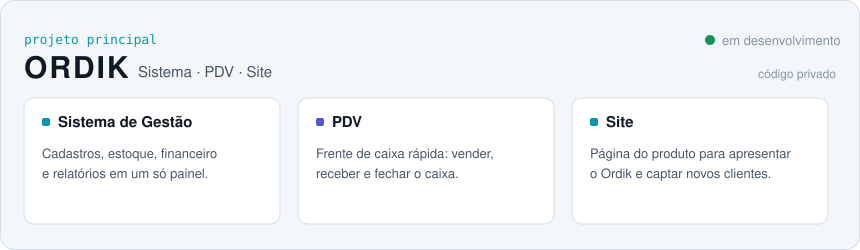
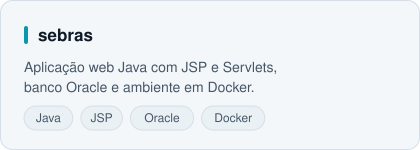
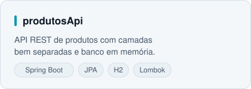
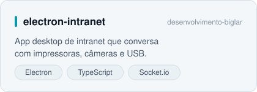
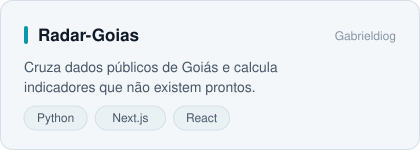

  <picture>
    <source media="(prefers-color-scheme: dark)" srcset="assets/banner-dark.svg">
    
  </picture>

  

  

  

  

<h3 align="center">Sobre mim</h3>

Sou **Engenheiro de Software** em Goiânia e estudo Engenharia de Software no Centro Universitário de Goiás. Hoje meu foco é o **Ordik**, meu projeto principal: um sistema de gestão, um PDV de frente de caixa e o site do produto, pensados para quem vende todos os dias.

No back-end trabalho com **Java, Spring Boot, JPA e Maven**. No front-end uso **Angular, Next.js e TypeScript**, e no desktop, **Electron**. Os dados ficam em **PostgreSQL, Supabase ou Oracle**, conforme o projeto.
Gosto de entender a rotina de quem vai usar o sistema antes de escrever a primeira linha, e de entregar a solução inteira: banco, API, interface e deploy.

 

  

<h3 align="center">Além do código</h3>

⬛ Aprendo construindo: boa parte dos repositórios aqui começou como trabalho da faculdade 
⬜ Gosto de sistemas de gestão, estoque e financeiro, onde cada centavo precisa bater 
⬛ Estudo arquitetura para o Ordik crescer sem virar bagunça 
⬜ Curto trabalhar em dupla e em equipe, trocando ideia e revisando código 
⬛ Sempre atrás da próxima coisa para aprender e colocar em prática 

  
  &nbsp;
  

 

  <h3 align="center">
    
    GitHub Stats</h3>
  

  <h3 align="center">
    
    Contribuições</h3>
  <picture>
    <source media="(prefers-color-scheme: dark)" srcset="https://raw.githubusercontent.com/guilhermelorec/guilhermelorec/output/github-contribution-grid-snake-dark.svg">
    
  </picture>

  <h3 align="center">
    
    Tech Stacks</h3>

  

  <a href="https://skillicons.dev">
      
      
      
  </a>
  

  <h3 align="center">
    
    Projetos em destaque</h3>

<picture>
  <source media="(prefers-color-scheme: dark)" srcset="assets/card-ordik-dark.svg">
  
</picture>

<table>
  <tr>
    <td>
      <a href="https://github.com/guilhermelorec/sebras">
        <picture>
          <source media="(prefers-color-scheme: dark)" srcset="assets/card-sebras-dark.svg">
          
        </picture>
      </a>
    </td>
    <td>
      <a href="https://github.com/guilhermelorec/produtosApi">
        <picture>
          <source media="(prefers-color-scheme: dark)" srcset="assets/card-produtosapi-dark.svg">
          
        </picture>
      </a>
    </td>
  </tr>
  <tr>
    <td>
      <a href="https://github.com/desenvolvimento-biglar/electron-intranet">
        <picture>
          <source media="(prefers-color-scheme: dark)" srcset="assets/card-electron-intranet-dark.svg">
          
        </picture>
      </a>
    </td>
    <td>
      <a href="https://github.com/Gabrieldiog/Radar-Goias">
        <picture>
          <source media="(prefers-color-scheme: dark)" srcset="assets/card-radar-goias-dark.svg">
          
        </picture>
      </a>
    </td>
  </tr>
</table>

<b>O que eu faço, em detalhe</b>

 

**Ordik, meu projeto principal**
- **Sistema de gestão**: cadastros, estoque, financeiro e relatórios em um só painel.
- **PDV**: frente de caixa para vender, receber e fechar o caixa sem enrolação.
- **Site**: a página do produto, que apresenta o Ordik e traz novos clientes.

**Back-end em Java**
- **sebras**: aplicação web com JSP, Servlets e Oracle, com ambiente em Docker e documentação por branch.
- **produtosApi**: API REST em Spring Boot, JPA e H2.
- **financeApp** e **best-financeiro**: controle de receitas e despesas, com PostgreSQL no Supabase e relatórios em CSV.
- **erp-swing** e **controleEstoque**: sistemas desktop de gestão e estoque em Java Swing.

**Front-end e desktop**
- **electron-intranet**: app desktop de intranet que integra impressoras, câmeras e USB.
- **e-commerce**, **login** e **lista-de-tarefas**: projetos em Angular com TypeScript e SCSS.
- **Radar Goiás**: plataforma que cruza dados públicos do estado, feita em Python e Next.js.

**Faculdade**
- Trabalhos de Engenharia de Software, POO e banco de dados.

O código do Ordik é privado.

<b>Linha do tempo</b>

 

| Quando | O que rolou |
| --- | --- |
| **Set 2024** | Primeiros projetos em Angular: lista de tarefas e tela de login |
| **Nov 2024** | E-commerce em Angular |
| **Abr 2025** | Java de verdade: lista de contatos, gestão de produtos e menu interativo |
| **Jun 2025** | Controle de estoque em Java |
| **Jul 2025** | ERP em Java Swing e finanças pessoais |
| **Out 2025** | Login em PHP com MVC |
| **Jan 2026** | Intranet desktop em Electron |
| **Mai 2026** | FinanceApp com PostgreSQL no Supabase |
| **Jun 2026** | Best Financeiro, sistema financeiro no terminal |
| **Ago 2026** | API REST de produtos com Spring Boot |
| **Set 2026** | sebras, Radar Goiás e o Ordik: sistema, PDV e site |

